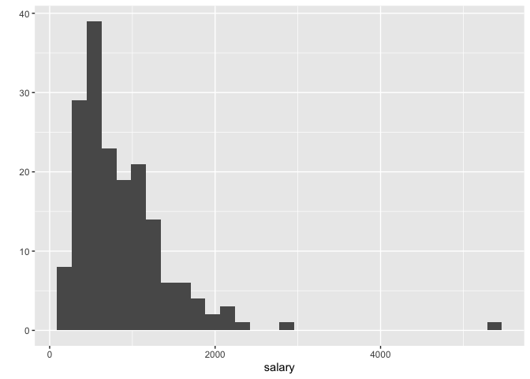
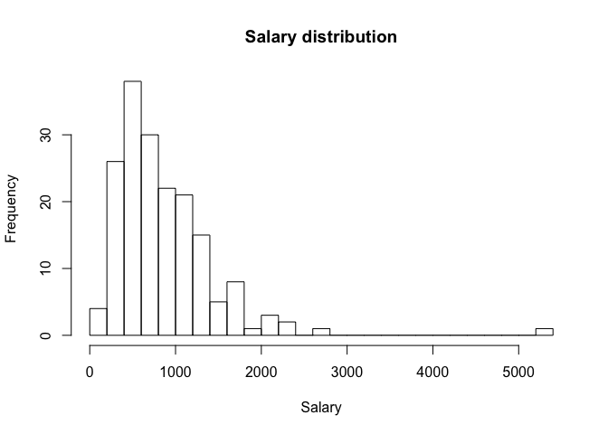
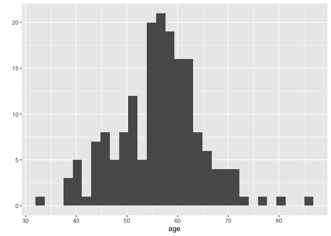
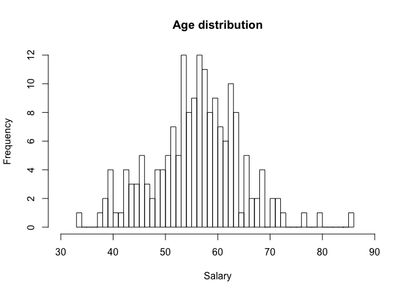
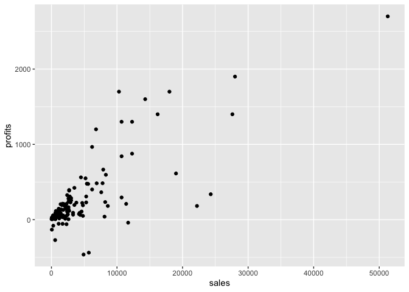
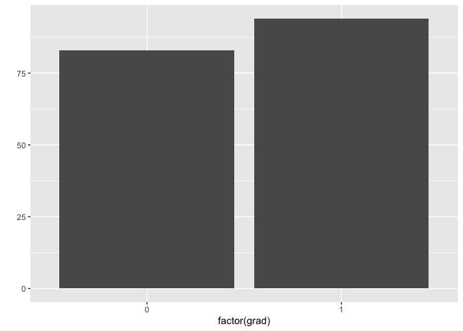
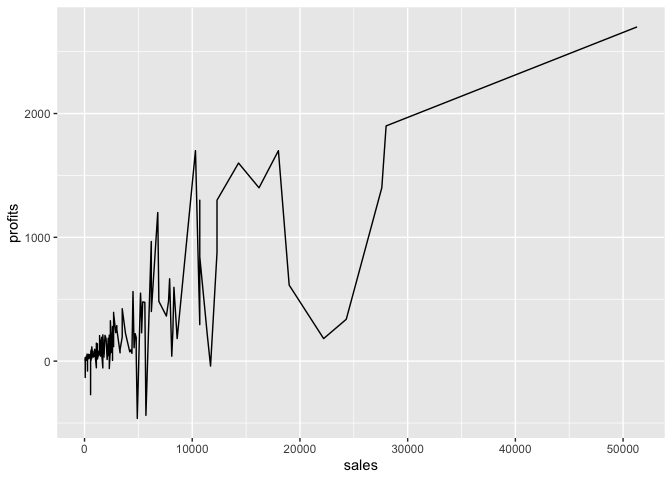
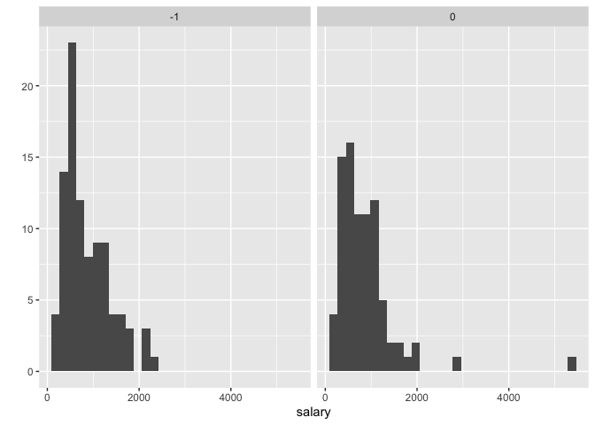

## Set the working directory


```r
setwd("/Users/andrea/Desktop/UEA /Classes/Econometrics /Data")
```

## Usage

```r
library(data.table)
library(ggplot2)
library(stargazer)
```

```
## 
## Please cite as:
```

```
##  Hlavac, Marek (2018). stargazer: Well-Formatted Regression and Summary Statistics Tables.
```

```
##  R package version 5.2.2. https://CRAN.R-project.org/package=stargazer
```

```r
library(rmarkdown)
```

## Data Analysis

```r
load("ceosal2.Rdata")
dt.cs <- data.table(data)
rm(data)
```

## Descriptive Statistics \
### How many CEOs are in the sample?

```r
nrow(dt.cs)
```

```
## [1] 177
```

### How many CEOs have a graduate degree?

```r
dt.cs[,sum(grad)] 
```

```
## [1] 94
```
alternatively 

```r
nrow(dt.cs[grad==1,])
```

```
## [1] 94
```
### What is the percentage of CEOs with graduate degree?

```r
dt.cs[,mean(salary)] 
```

```
## [1] 865.8644
```
alternatively 

```r
dt.cs[,mean(grad)]
```

```
## [1] 0.5310734
```
### What is the average CEO salary?

```r
dt.cs[,sum(grad)]/nrow(dt.cs) 
```

```
## [1] 0.5310734
```
alternatively 

```r
mean(dt.cs[,salary])
```

```
## [1] 865.8644
```

### What is the mean CEO salary for those with a gradueate degree?

```r
dt.cs[grad==1, mean(salary)] 
```

```
## [1] 864.2128
```

### What is the mean CEO salary for those without a gradueate degree?

```r
dt.cs[grad==0, mean(salary)]
```

```
## [1] 867.7349
```

### How many CEOs have/don't a college degree?

```r
dt.cs[,list(n_ceo=.N), by = college]
```

```
##    college n_ceo
## 1:       1   172
## 2:       0     5
```

### Can we say that the mean salary is statistically significant different from 800?

```r
t.test(dt.cs[, salary], mu = 800)
```

```
## 
## 	One Sample t-test
## 
## data:  dt.cs[, salary]
## t = 1.4913, df = 176, p-value = 0.1377
## alternative hypothesis: true mean is not equal to 800
## 95 percent confidence interval:
##  778.7015 953.0274
## sample estimates:
## mean of x 
##  865.8644
```
### Is the average salary different from CEOs with a graduate degree and those without?

```r
t.test(dt.cs[, salary] - dt.cs[,grad])
```

```
## 
## 	One Sample t-test
## 
## data:  dt.cs[, salary] - dt.cs[, grad]
## t = 19.593, df = 176, p-value < 2.2e-16
## alternative hypothesis: true mean is not equal to 0
## 95 percent confidence interval:
##  778.1701 952.4965
## sample estimates:
## mean of x 
##  865.3333
```
alternatively 

```r
dt.cs[,t.test(salary - grad)] 
```

```
## 
## 	One Sample t-test
## 
## data:  salary - grad
## t = 19.593, df = 176, p-value < 2.2e-16
## alternative hypothesis: true mean is not equal to 0
## 95 percent confidence interval:
##  778.1701 952.4965
## sample estimates:
## mean of x 
##  865.3333
```
alternatively 

```r
t.test(dt.cs[grad==0 , salary], dt.cs[grad==1, salary])
```

```
## 
## 	Welch Two Sample t-test
## 
## data:  dt.cs[grad == 0, salary] and dt.cs[grad == 1, salary]
## t = 0.038973, df = 149.94, p-value = 0.969
## alternative hypothesis: true difference in means is not equal to 0
## 95 percent confidence interval:
##  -175.0489  182.0932
## sample estimates:
## mean of x mean of y 
##  867.7349  864.2128
```

### Creating a table with descriptive statistics

```r
dt.cs[,list(mean_salary = mean(salary)
           , sd_salary = sd(salary)
           , min_salary = min(salary)
           , max_salary = max(salary)
           , median_salary = median(salary))]
```

```
##    mean_salary sd_salary min_salary max_salary median_salary
## 1:    865.8644  587.5893        100       5299           707
```
           
### Summary statistics for different groups

```r
dt.cs[,list(mean_salary = mean(salary)
           , sd_salary = sd(salary)
           , min_salary = min(salary)
           , max_salary = max(salary)
           , median_salary = median(salary)), by = list (grad, college)]
```

```
##    grad college mean_salary sd_salary min_salary max_salary median_salary
## 1:    1       1    864.2128  501.3924        100       2265         705.5
## 2:    0       1    853.0897  679.0268        174       5299         708.5
## 3:    0       0   1096.2000  633.4569        300       1738        1143.0
```
alternatively 

```r
stargazer(dt.cs, type="text")
```

```
## 
## ===================================================================
## Statistic  N    Mean    St. Dev.    Min    Pctl(25) Pctl(75)  Max  
## -------------------------------------------------------------------
## salary    177  865.864   587.589    100      471     1,119   5,299 
## age       177  56.429     8.422      33       52       62      86  
## college   177   0.972     0.166      0        1        1       1   
## grad      177   0.531     0.500      0        0        1       1   
## comten    177  22.503    12.295      2        12       33      58  
## ceoten    177   7.955     7.151      0        3        11      37  
## sales     177 3,529.463 6,088.654    29      561     3,500   51,300
## profits   177  207.831   404.454    -463      34      208    2,700 
## mktval    177 3,600.316 6,442.276   387      644     3,500   45,400
## lsalary   177   6.583     0.606    4.605    6.155    7.020   8.575 
## lsales    177   7.231     1.432    3.367    6.330    8.161   10.845
## lmktval   177   7.399     1.133    5.958    6.468    8.161   10.723
## comtensq  177  656.684   577.123     4       144     1,089   3,364 
## ceotensq  177  114.124   212.566     0        9       121    1,369 
## profmarg  177   6.420    17.861   -203.077  4.231    10.947  47.458
## -------------------------------------------------------------------
```
in case of a subset 

```r
stargazer(dt.cs[grad==1, list(age, salary)], type="text")
```

```
## 
## =========================================================
## Statistic N   Mean   St. Dev. Min Pctl(25) Pctl(75)  Max 
## ---------------------------------------------------------
## age       94 55.457   8.155   38     50       61     86  
## salary    94 864.213 501.392  100  481.5   1,167.8  2,265
## ---------------------------------------------------------
```

## QUICK PLOTS
### Histogram
Salary

```r
qplot(data=dt.cs
      , x=salary
      , geom="histogram")
```

```
## `stat_bin()` using `bins = 30`. Pick better value with `binwidth`.
```

<!-- -->
\
alternatively

```r
hist(dt.cs$salary, main='Salary distribution', xlab='Salary',breaks=25)
```

<!-- -->

      
Age

```r
qplot(data=dt.cs
      , x=age
      , geom="histogram")
```

```
## `stat_bin()` using `bins = 30`. Pick better value with `binwidth`.
```

<!-- -->
\
alternatively

```r
hist(dt.cs$age, main='Age distribution', xlab='Salary',breaks=50, xlim=c(30,90))
```

<!-- -->


### Scatterplot

```r
qplot(data=dt.cs
      , x=sales
      , y=profits
      , geom="point")
```

<!-- -->
      
### Barplot
graduate

```r
qplot(data=dt.cs
     , x=factor(grad)
     , geom= "bar")
```

<!-- -->
          
### Line 

```r
qplot(data=dt.cs
      , x=sales
      , y = profits
      , geom="line")
```

<!-- -->
      
### Facet Wrap

```r
qplot(data=dt.cs
      , x=salary
      , geom="histogram") + facet_wrap(- dt.cs$grad)
```

```
## `stat_bin()` using `bins = 30`. Pick better value with `binwidth`.
```

<!-- -->
      
### Customizing plots
Salary

```r
qplot(data=dt.cs
      , x=salary
      , geom="histogram"
      , fill = factor(grad, levels = c(0,1), labels = c("Yes" , "No"))) +
      theme_bw() +
      ylim (0,50) +
      xlim (0, 4000) +
      labs (title = "MY PLOT", x= "CEO Salary", y="Number of CEOs", fill= "Grad. Degree")
```

```
## `stat_bin()` using `bins = 30`. Pick better value with `binwidth`.
```

```
## Warning: Removed 1 rows containing non-finite values (stat_bin).
```

```
## Warning: Removed 4 rows containing missing values (geom_bar).
```

<!-- -->

